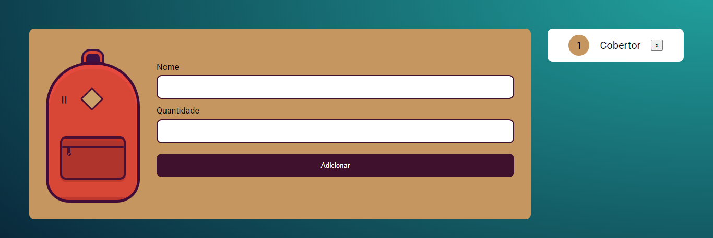

<h3 align="center">
  JS: Mochila de viagem
</h3>

<p align="center">Desenvolvimento de um sistema web para criar uma lista de items</p>

<p align="center">
  <a href="#como-executar-o-projeto">Como executar o projeto</a>&nbsp;&nbsp;&nbsp;|&nbsp;&nbsp;&nbsp;
  <a href="#Técnologias-utilizadas">Técnologias utilizadas</a>
</p>

<p align="center">Front-end</p>

<p align="center">
  
</p>

## Como executar o projeto

### Clonar este repositório

```bash
git clone git@github.com:lyoto07/mochila-de-viagem-main.git
```

### Executar

- `Abrir o arquivo .html

## Técnologias utilizadas

- HTML
- CSS
- JS

